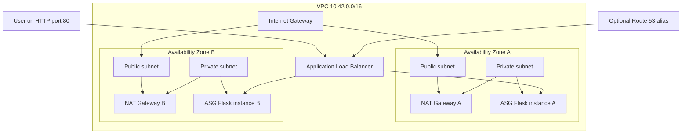

# Day 31: Highly Available AWS Infrastructure with Terraform

This project provisions a two-AZ AWS environment for the Flask metrics
application built at the repository root. Terraform creates public and private
subnets, per-AZ NAT gateways, tightly scoped security groups, an internet-facing
Application Load Balancer, and an Auto Scaling Group running an immutable GHCR
image in private subnets.

## Architecture



Only the ALB accepts internet traffic. Application instances accept port 5000
only from the ALB security group; they receive no public IP address and expose
no SSH ingress.

## Terraform modules

| Module | Responsibility |
| --- | --- |
| `modules/vpc` | VPC, two public/private subnet pairs, IGW, per-AZ NAT gateways, and route tables |
| `modules/security` | Public ALB ingress and ALB-only application ingress |
| `modules/compute` | Amazon Linux launch template, Docker bootstrap, ASG, and CPU target tracking |
| `modules/alb` | ALB, target group, `/healthz` checks, and HTTP listener |
| `modules/route53` | Optional public hosted zone and ALB alias for an owned domain |

## Validate and plan

```bash
cd terraform
terraform init
terraform fmt -check -recursive
terraform validate
terraform plan -out=tfplan
```

Copy `terraform.tfvars.example` to an ignored `terraform.tfvars` file to
override defaults. The checked-in example contains no credentials.

The default plan deliberately disables Route 53 because no owned domain was
available during validation. To validate the DNS resources without claiming a
live domain:

```bash
terraform plan \
  -var='enable_route53=true' \
  -var='domain_name=portfolio.example.com'
```

`portfolio.example.com` is a documentation placeholder, not a live portfolio
domain. Do not enable it for an apply; replace it with a domain you control.

## Apply/destroy evidence

On July 22–23, 2026, this configuration completed a real apply in `us-east-1`
using the Route 53-disabled plan:

```text
Default plan: 28 to add, 0 to change, 0 to destroy
Route 53 validation plan: 30 to add, 0 to change, 0 to destroy
VPC: vpc-0dc51f3422c6a9c02
ALB: devops-practice-alb-545159498.us-east-1.elb.amazonaws.com
ASG: devops-practice-ca85b88c97c9775b9ee7f42eb3
Targets: 2 healthy across us-east-1a and us-east-1b
GET /healthz: {"status":"ok"}
Destroy verification: No changes. No objects need to be destroyed.
```

The ASG also demonstrated recovery behavior during validation: one instance
failed its initial load-balancer health check, the ASG terminated it, launched
a replacement, and returned to two healthy targets. All resources were then
destroyed to stop EC2, NAT gateway, and ALB charges. See the sanitized
[plan evidence](docs/plan-output.txt).

## HTTPS and Route 53 limitation

The live validation used HTTP on port 80. HTTPS was not configured because no
owned domain and ACM certificate were available. The Route 53 module and alias
record pass `terraform plan`, but were not applied. Therefore the accurate
claim is: **the AWS network, ALB, ASG, and Terraform automation were deployed
and tested; Route 53 was implemented and plan-validated, not deployed to a
real domain.**

## What I built

I built reusable Terraform modules for a highly available AWS application
environment. I placed load balancing and NAT in public subnets, application
instances in private subnets, restricted inbound application traffic to the
ALB, used an immutable image from the CI pipeline, verified ALB health and ASG
replacement behavior, and completed an apply/destroy cycle so the portfolio
does not leave chargeable infrastructure running.
