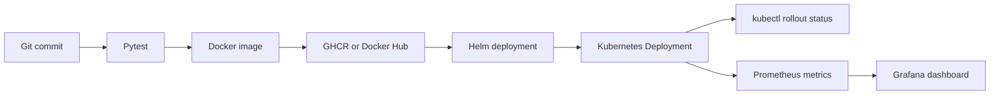

# DevOps Hands-On Practice

This repository is a structured practice log covering Docker, Kubernetes,
Helm, Jenkins, GitHub Actions, Prometheus, and Grafana. The exercises culminate
in one integrated Flask metrics application at the repository root. Individual
day folders are learning records; they are not presented as production
systems.

## Integrated 45-day project

The root project implements this path:



The application provides:

- `GET /` — application message and version
- `GET /healthz` — readiness and liveness check
- `GET /metrics` — Prometheus metrics

### Project layout

| Path | Purpose |
| --- | --- |
| `app/` | Flask application and pinned runtime dependencies |
| `tests/` | Pytest health, configuration, and metrics tests |
| `Dockerfile` | Non-root Python application image |
| `docker-compose.yml` | Local app, Prometheus, and Grafana stack |
| `charts/app/` | Canonical Helm Deployment, Service, probes, and RBAC |
| `.github/workflows/ci-cd.yml` | Test, image build, GHCR push, optional Helm deploy |
| `Jenkinsfile` | Test, Docker Hub push, Helm deploy, rollout verification |
| `monitoring/` | Prometheus scrape and Grafana provisioning files |
| `kubernetes/` | Plain-manifest alternative for learning and inspection |

## Run locally

Copy the environment template and change values if required:

```bash
cp .env.example .env
python -m venv .venv
source .venv/bin/activate
python -m pip install -r requirements-dev.txt
pytest -q
python app/app.py
```

On Windows PowerShell, activate the environment with
`.venv\Scripts\Activate.ps1`. Open <http://localhost:5000>,
<http://localhost:5000/healthz>, or <http://localhost:5000/metrics>.

Start the complete local monitoring stack with:

```bash
docker compose up --build
```

- Application: <http://localhost:5000>
- Prometheus: <http://localhost:9090>
- Grafana: <http://localhost:3000>

The local Grafana login is `admin` / `admin`; it is intentionally limited to
local practice and must not be reused for an exposed environment. The
Prometheus datasource and DevOps Practice dashboard are provisioned
automatically.

## Deploy to Kubernetes

Build and push an immutable image tag:

```bash
IMAGE_REPOSITORY=your-registry/devops-45day-practice
IMAGE_TAG=$(git rev-parse --short=12 HEAD)
docker build -t "$IMAGE_REPOSITORY:$IMAGE_TAG" .
docker push "$IMAGE_REPOSITORY:$IMAGE_TAG"
```

Deploy that exact image and verify the rollout:

```bash
kubectl create namespace devops-practice --dry-run=client -o yaml | kubectl apply -f -
helm upgrade --install devops-practice charts/app \
  --namespace devops-practice \
  --set image.repository="$IMAGE_REPOSITORY" \
  --set image.tag="$IMAGE_TAG" \
  --set image.pullPolicy=Always
kubectl rollout status deployment/devops-practice \
  --namespace devops-practice --timeout=180s
```

## Pipeline stages

1. Checkout the commit.
2. Install pinned application and test dependencies.
3. Run the Pytest suite.
4. Build a Docker image tagged with the full commit SHA.
5. Push the immutable image to the configured registry.
6. Upgrade the application through `charts/app`.
7. Wait for `kubectl rollout status`; a failed rollout fails the pipeline.

GitHub Actions always tests and builds. Pushes to `main` publish to GHCR. The
deploy stages run only when a base64-encoded `KUBE_CONFIG` repository secret is
configured. Jenkins expects a username/password credential named `dockerhub`
and an authenticated Kubernetes context on its agent.

## Validation evidence

The following checks were run locally on July 22, 2026 after remediation:

```text
$ python -m pytest -q
...                                                                      [100%]
3 passed in 0.84s

$ helm lint charts/app
1 chart(s) linted, 0 chart(s) failed
```

Docker Desktop was installed but its Linux engine was initially unavailable,
then started successfully. The image built and the complete Compose stack was
checked live:

```text
application health: ok
application version: local-compose
metrics contains app_requests_total: true
Prometheus target health: up
Grafana database: ok (12.1.0)
provisioned dashboard: DevOps Practice Application
```

The configured Kubernetes endpoint was no longer reachable. Therefore, this
remediation does not claim a successful live registry push or cluster rollout.
The CI/CD definitions include those steps and fail loudly on rollout errors,
but their first authenticated live run remains required evidence.

## Exercise log and recovery notes

The day folders retain focused Docker, Kubernetes, Linux, Bash, Jenkins, and
Helm exercises. During remediation, seven accidental gitlinks were replaced
with normal tracked paths. Day 6 was recovered from its matching public
repository. The original contents for Days 9–10, 15, 27, 28, and 35 and the
old `terraform` path were unavailable; those folders contain recovery notices
rather than invented replacements.

Day 31 now contains modular Terraform for a two-AZ VPC, public/private
subnets, per-AZ NAT gateways, scoped security groups, an ALB, an Auto Scaling
Group, and optional Route 53. It completed a real apply, ALB health check, ASG
replacement test, and destroy cycle. Route 53 was plan-validated but not
applied because no owned domain was available.

## Related project

[cloud-monitoring-ai-ops](https://github.com/jagan-SRE/cloud-monitoring-ai-ops)
extends the monitoring work as a separate, focused project. It queries
Prometheus health, detects log anomalies, retrieves operational runbooks from
Chroma, and prepares grounded OpenAI-assisted triage responses.

## Current scope

Working code in this repository demonstrates Python/Flask, Docker,
Kubernetes manifests, Helm, Jenkins, GitHub Actions, Prometheus, Grafana,
Terraform, and AWS VPC/EC2/ALB/Auto Scaling infrastructure. It does not
demonstrate EKS provisioning, GitOps, Rails, Databricks, or AI/RAG
troubleshooting. Those technologies are deliberately excluded from the
project claims until corresponding working implementations exist.

## What I built

I integrated the strongest practice exercises into one testable Flask
application. I containerized it, exposed health and Prometheus endpoints,
made Helm the canonical Kubernetes deployment path, added namespace-scoped
RBAC, and connected both GitHub Actions and Jenkins to immutable image tags
and rollout verification. I also provisioned a local Prometheus/Grafana stack
for inspecting application availability and request rate.

## License

Released under the [MIT License](LICENSE).
